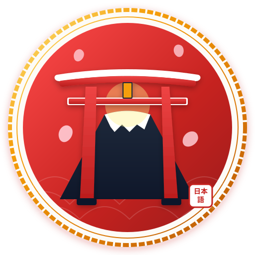

# 🌸 日本語教育 — Nihongo Education

<p align="center">
  
</p>

<p align="center">
  <strong>Learn Japanese Beautifully. Interactive Quizzes, Vocabulary Drills & Live Classroom Multiplayer Arena.</strong><br>
  Built for <strong>UHB10802 — Japanese Communication 1</strong> at Universiti Tun Hussein Onn Malaysia (UTHM).
</p>

<p align="center">
  
  
  
  
  
  
</p>

---

## ✨ What's New & Core Features

### 1. 🎓 Classroom Game Studio (`/admin/multiplayer`)
- **Teacher Command Center**: Launch tailored multiplayer sessions for your classroom.
- **1-Click Lesson Presets**:
  - `🎌 Morning Greetings Warmup` (Greetings, 5 Qs, 15s)
  - `🍣 Food & Dining Challenge` (Food, 5 Qs, 20s)
  - `🏃 Action Verbs Speed Drill` (Verbs, 4 Qs, 10s Speedrun)
  - `🐻 Animals & Pets Sprint` (Animals, 3 Qs, 15s)
  - `🏆 Comprehensive JLPT N5 Exam` (All Topics, 20 Qs, 15s)
- **Interactive Rules Customizer**: Select specific categories, deck sizes (5–20 questions), and timers (10s, 15s, 20s, 30s).
- **Match Records & Analytics**: Live Supabase leaderboard tracking student scores and accuracy.

### 2. 📝 Question Studio with Picture Upload (`/admin/questions`)
- **Direct Image Upload**: Select and upload JPG, PNG, WebP, SVG, and GIF illustrations directly into the app.
- **Live Thumbnail Preview**: Real-time image preview with instant replace/remove options.
- **One-Click & Auto GitHub Sync**: Commit and push newly uploaded images and question changes straight to GitHub (`origin/main` & `preview/main`) from the admin interface.
- **Filter by Media**: Easily filter questions by *Pictures Uploaded* vs *Emoji Fallback*.

### 3. 👑 Real-Time Multiplayer Arena (`/host` & `/play`)
- **Kahoot-Style Gameplay**: Host creates a game room with a 6-digit PIN; students join from smartphones or laptops.
- **Synchronized Countdown**: Real-time synchronized timer (10s–30s) across all student devices.
- **Native Japanese TTS Pronunciation**: Auto-pronounces vocabulary questions for listening practice.
- **Player Moderation**: Host can kick/remove disruptive or test names from the lobby before game start.
- **Podium Fanfare & Leaderboard**: Animated award podium for 1st, 2nd, and 3rd place with custom celebratory sound effects.

### 4. 📜 Authentic Japanese Certificate Generator
- **Completion Diploma**: Awarded upon completing quiz modules.
- **Traditional Cultural Details**:
  - Ornate Japanese Gold Border with cherry blossom sakura corners.
  - Mount Fuji silhouette & Vermilion Torii Gate.
  - Traditional Red Hanko Seal (判子) stamped with *一期一会* (Treasure every meeting).
  - Dynamic QR Code linking back to the exhibition (`SCAN TO PLAY`).
  - Editable Student Recipient Name.
- **Export Formats**: High-DPI PNG download or print-ready PDF certificate.

### 5. 🎋 Zen Atmosphere & Cultural UI
- **Zen Background Music (BGM)**: Traditional Shakuhachi & Koto ambient soundtrack with volume slider and persistent playback.
- **Interactive Japanese Feedback Modals**:
  - Correct answer: `🎌 よくできました！` (Well done!) with celebratory point confetti.
  - Incorrect answer: `😅 もう一度！` (Try again!) with pronunciation tips, hints, and answer reveals.
- **AFK Screensaver**: Auto-activates after 15s of inactivity with illustrated cultural scenery slides and frosted glass blur.
- **Seigaiha Wave Scenery & Dark Mode**: Traditional wave patterns, floating sakura petals, and seamless light/dark theme toggle.

---

## 📚 Vocabulary Curriculum (10 Learning Modules)

| # | Category | Japanese | Kanji / Kana | Question Count | Description |
|---|---|---|---|:---:|---|
| 1 | **Greetings** | あいさつ | こんにちは, おはよう | 5 | Common Japanese hellos, goodbyes, and polite greetings |
| 2 | **Numbers** | すうじ | 一, 二, 三, 百 | 7 | Master counting numbers from 1 to 100 |
| 3 | **Food** | たべもの | 寿司, ラーメン, ご飯 | 5 | Delicious sushi, ramen, green tea, and meal expressions |
| 4 | **Colors** | いろ | 赤, 青, 白, 黒 | 5 | Core colors in Japanese kanji and hiragana |
| 5 | **Daily Phrases** | にちじょうのフレーズ | いただきます, すみません | 5 | Essential daily manners and polite dining expressions |
| 6 | **Verbs** | どうし | たべます, いきます | 4 | Action verbs for everyday activities |
| 7 | **Adjectives** | けいようし | おおきい, ちいさい | 3 | Descriptive words for sizes and qualities |
| 8 | **Body Parts** | からだ | め, て, あたま | 2 | Anatomy and face vocabulary |
| 9 | **Animals** | どうぶつ | いぬ, ねこ, くま | 3 | Animal names with custom illustrated images |
| 10 | **Family** | かぞく | かぞく, ともだち | 2 | Talking about family members and friends |

---

## 🛠️ Technology Stack

- **Framework**: [Next.js 16 (App Router & Turbopack)](https://nextjs.org/)
- **Frontend Core**: [React 19](https://react.dev/), [TypeScript 5](https://www.typescriptlang.org/)
- **Styling**: [Tailwind CSS v4](https://tailwindcss.com/) with custom Japanese Seigaiha & Torii design tokens
- **Real-Time Multiplayer**: [Supabase Realtime (Presence & Broadcast Channels)](https://supabase.com/)
- **Certificate Export**: [`html-to-image`](https://www.npmjs.com/package/html-to-image) & [`jspdf`](https://www.npmjs.com/package/jspdf)
- **Speech Synthesis**: Web Speech API (`SpeechSynthesisUtterance` for native Japanese voice)
- **Audio / SFX**: HTML5 Audio API for Zen Shakuhachi BGM & celebratory fanfares

---

## 🚀 Getting Started

### 1. Clone the Repository
```bash
git clone https://github.com/Shan0h/Nihongo-Language.git
cd Nihongo-Language
```

### 2. Install Dependencies
```bash
npm install
```

### 3. Configure Environment Variables
Create a `.env.local` file in the root directory:
```env
NEXT_PUBLIC_SUPABASE_URL=https://cdnbxbdgdidsoeipnigh.supabase.co
NEXT_PUBLIC_SUPABASE_ANON_KEY=your_supabase_anon_key
```

### 4. Run Development Server
```bash
npm run dev
```

Open [http://localhost:3000](http://localhost:3000) in your browser.

---

## 📂 Project Architecture

```
Nihongo-Language/
├── app/
│   ├── page.tsx                  # Homepage with Quick Host, Solo Topics & Top Players
│   ├── layout.tsx                # Root layout (BGM player, Dark mode, Favicon, AFK)
│   ├── admin/
│   │   ├── page.tsx              # Admin studio dashboard
│   │   ├── login/page.tsx        # Secure admin login (password: admin123)
│   │   ├── multiplayer/page.tsx  # Classroom Game Studio (Presets, Timers, Analytics)
│   │   ├── questions/page.tsx    # Question manager with image upload & GitHub sync
│   │   └── categories/page.tsx   # Category overview
│   ├── api/admin/
│   │   ├── upload/route.ts       # Image upload endpoint (saves to public/images/questions/)
│   │   ├── questions/route.ts    # Question CRUD endpoint (persists to data/questions.json)
│   │   └── git-sync/route.ts     # One-click commit & push to GitHub
│   ├── components/
│   │   ├── Logo.tsx              # Reusable bilingual Nihongo Education vector logo
│   │   ├── CertificateModal.tsx  # Gold diploma generator (PNG & PDF export)
│   │   ├── BgmPlayer.tsx         # Traditional Shakuhachi Zen BGM player
│   │   ├── AfkScreensaver.tsx    # Illustrated Japanese screensaver
│   │   └── DarkModeToggle.tsx    # Light/Dark mode switcher
│   ├── host/page.tsx             # Real-time multiplayer host screen (lobby & question view)
│   ├── play/page.tsx             # Mobile student player interface (PIN join & answer buttons)
│   ├── quiz/[slug]/page.tsx      # Solo quiz screen with Japanese feedback modals
│   ├── scoreboard/page.tsx       # Live leaderboard
│   └── hooks/
│       └── useMultiplayer.ts     # Supabase Realtime multiplayer engine
├── data/
│   ├── questions.json            # Persistent JSON question database
│   └── questions.ts              # TypeScript interface & categories definition
└── public/
    ├── images/
    │   ├── logo.svg              # Official vector crest logo
    │   ├── questions/            # Category-sorted question pictures
    │   ├── afk/                  # Illustrated scenery slides
    │   └── audio/                # Zen Shakuhachi BGM & fanfare SFX
    └── favicon.ico               # Tab icon
```

---

## 🔐 Admin Studio Credentials

- **URL**: [http://localhost:3000/admin](http://localhost:3000/admin)
- **Password**: `admin123`
- **Capabilities**:
  - Launch tailored classroom multiplayer rooms with custom categories and timers.
  - Upload question pictures directly and edit vocabulary definitions.
  - One-click push changes and new images to GitHub.

---

## 👥 Course & Attribution

- **Course**: UHB10802 — Japanese Communication 1
- **Institution**: Universiti Tun Hussein Onn Malaysia (UTHM)
- **Developer**: Shan0h ([github.com/Shan0h](https://github.com/Shan0h))
- **Live Deployment**: Vercel Cloud Platform

---

<p align="center">
  Made with ❤️ & 🌸 for Japanese Language Education<br>
  <em>一期一会 — Treasure every encounter</em>
</p>
